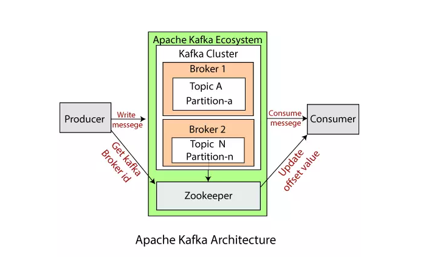
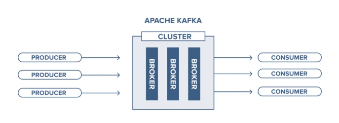
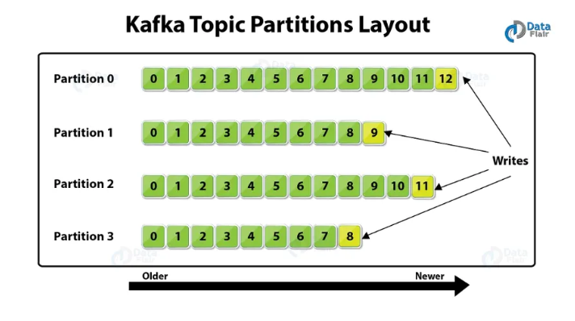
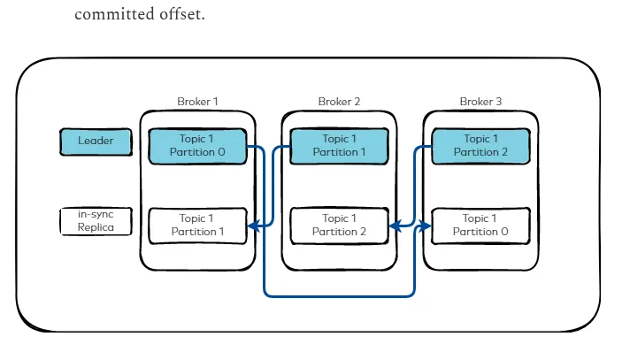

## Prerequisites
1. To verify that Apache Kafka is running, run the following command:
```bash
docker ps | grep kafka
```
2. If it is not running.
```bash
cd docker/local/kafka 
docker-compose up
```

## Quick Start
```bash
bundle exec rails console
```
1. To [produce messages](https://karafka.io/docs/Producing-Messages/), open the development console and enter:`
```ruby
Karafka.producer.produce_sync(topic: 'example', payload: { 'ping' => 'pong' }.to_json)
```
```bash
ruby-kafka(dev)> Karafka.producer.produce_sync(topic: 'example', payload: { 'ping' => 'pong' }.to_json)
[waterdrop-0485e372fb75] Sync producing of a message to 'example' topic took 118.84 ms
=> #<Rdkafka::Producer::DeliveryReport:0x000077dca3c99990 @error=nil, @label=nil, @offset=0, @partition=0, @topic_name="example">
```

2. To [consume messages](https://karafka.io/docs/Consuming-Messages/), run the following command in a separate terminal:
```bash
bundle exec karafka server

[f01618137d18] Polling messages...
[f01618137d18] Polled 6 messages in 999.58ms
[f573b01f2bd5] Consume job for ExampleConsumer on example-0 started
{"ping" => "pong"}
{"ping" => "pong"}
{"ping" => "pong"}
{"ping" => "pong"}
{"ping" => "pong"}
{"ping" => "pong"}
```

## How Karafka Producer Works

### Producer Architecture
Karafka uses **WaterDrop** as its producer library. The producer is configured and initialized when the Karafka application starts in `karafka.rb`.

### Producing Messages Step-by-Step

1. **Producer Initialization**
   - The producer is configured in `karafka.rb` with connection settings like `bootstrap.servers`
   - `Karafka.producer` returns a singleton WaterDrop producer instance
   - The producer maintains a connection pool to Kafka brokers

2. **Sending a Message**
   ```ruby
   Karafka.producer.produce_sync(
     topic: 'example',           # Target topic name
     payload: { 'ping' => 'pong' }.to_json,  # Message content (must be string or binary)
     key: 'optional_key',        # Optional: determines partition routing
     partition: 0                # Optional: specific partition (otherwise determined by key or round-robin)
   )
   ```

3. **Message Flow**
   - **Serialization**: The payload is serialized (typically to JSON)
   - **Partition Selection**: 
     - If `partition` is specified → goes to that partition
     - If `key` is provided → Kafka hashes the key to determine partition
     - If neither → round-robin distribution across partitions
   - **Broker Connection**: Producer connects to the leader broker for that partition
   - **Acknowledgment**: 
     - `produce_sync`: Blocks until broker acknowledges receipt
     - `produce_async`: Returns immediately, handles delivery asynchronously

4. **Delivery Report**
   - Returns `Rdkafka::Producer::DeliveryReport` containing:
     - `offset`: Position in the partition where message was stored
     - `partition`: Which partition received the message
     - `topic_name`: Confirmation of the topic
     - `error`: Any error that occurred (nil on success)

### Producer Methods

- **`produce_sync`**: Synchronous - waits for broker acknowledgment (slower but guaranteed)
- **`produce_async`**: Asynchronous - fire-and-forget (faster but requires error handling via callbacks)
- **`produce_many_sync`**: Batch synchronous production for multiple messages
- **`produce_many_async`**: Batch asynchronous production

### Producer Shutdown
Before shutting down, always call `Karafka.producer.close` to flush pending messages in the buffer.

---

## How Karafka Consumer Works

### Consumer Architecture
Karafka consumers are Ruby classes that inherit from `ApplicationConsumer` (which inherits from `Karafka::BaseConsumer`).

### Consumer Routing - How Karafka Knows Which Consumer to Use

The magic happens in **`karafka.rb`** routing configuration:

```ruby
# karafka.rb
routes.draw do
  topic :example do
    consumer ExampleConsumer  # This maps the 'example' topic to ExampleConsumer class
  end
  
  topic :user_events do
    consumer UserEventsConsumer  # Different topic → different consumer
  end
end
```

**Key Points:**
- Each `topic` block defines a subscription
- The `consumer` method explicitly maps the topic name to a consumer class
- **Topic names must be SPECIFIC** (e.g., `'user_events'`, `'example'`) - you cannot use wildcards like `'user_*'`
- When Karafka server starts, it reads this routing table and subscribes to all defined topics
- Incoming messages from each topic are automatically routed to their configured consumer

#### Topic Patterns (Regex Matching) - Karafka Pro Feature ⭐

If you need to match multiple topics dynamically using regex patterns (e.g., `user_*`), this is available in **[Karafka Pro](https://karafka.io/docs/Pro/)** (commercial version):

```ruby
# Karafka Pro only - requires license
routes.draw do
  # Match any topic starting with "user_"
  pattern(/^user_.*/) do
    consumer UserEventsConsumer
  end
  
  # Named pattern for better readability
  pattern('analytics_topics', /^analytics_.*/) do
    consumer AnalyticsConsumer
  end
end
```

**Pattern Features:**
- Use Ruby regex to match multiple topics dynamically
- Automatically subscribes to new topics matching the pattern
- Useful for multi-tenant systems or dynamic topic creation
- Can be named or anonymous (auto-generated name based on regex)
- **Note**: Requires Karafka Pro license

**OSS (Open Source) Version:**
- Must define each topic explicitly by name
- No wildcard or regex support
- Example: Define `topic :user_events`, `topic :user_analytics` separately

### Consumer Lifecycle

1. **Server Startup**
   ```bash
   bundle exec karafka server
   ```
   - Karafka reads `karafka.rb` routing configuration
   - Subscribes to all defined topics with the configured `group_id`
   - Connects to Kafka brokers specified in `bootstrap.servers`
   - Starts polling loop

2. **Polling Messages**
   - Karafka continuously polls Kafka brokers for new messages
   - Default poll interval: ~1 second
   - Fetches messages in batches for efficiency

3. **Message Consumption**
   ```ruby
   class ExampleConsumer < ApplicationConsumer
     def consume
       messages.each do |message|
         puts message.payload      # Access message content
         puts message.offset       # Message offset in partition
         puts message.partition    # Which partition it came from
         puts message.key          # Message key (if any)
         puts message.headers      # Message headers (metadata)
       end
     end
   end
   ```

4. **Routing Logic**
   - Karafka polls `example` topic
   - Finds routing: `topic :example → consumer ExampleConsumer`
   - Instantiates `ExampleConsumer` (or reuses if `consumer_persistence: true`)
   - Calls `ExampleConsumer#consume` with the batch of messages
   - Messages are available via the `messages` method

5. **Offset Commit**
   - After successful consumption, Karafka automatically commits the offset
   - Kafka tracks which messages this consumer group has processed
   - On restart, consumption resumes from the last committed offset

### Consumer Group Coordination

```ruby
# karafka.rb
config.group_id = 'YOUR_APP_NAME_consumer'
```

- **`group_id`**: Identifies this consumer group to Kafka
- Multiple instances with the same `group_id` share partition consumption
- Each partition is consumed by only one consumer instance in the group
- Kafka handles partition rebalancing when consumers join/leave

### Consumer Methods

- **`consume`**: Main method called for each batch of messages (required)
- **`messages`**: Access the batch of messages from Kafka
- **`revoked`**: Called when partitions are revoked during rebalancing
- **`shutdown`**: Called when Karafka server stops (cleanup logic)

### Message Object Properties

```ruby
message.payload      # The message content (string)
message.raw_payload  # Raw binary payload
message.offset       # Unique ID within partition
message.partition    # Partition number
message.key          # Optional routing key
message.headers      # Hash of metadata headers
message.timestamp    # When message was produced
message.topic        # Topic name
```

### Consumer Persistence

```ruby
config.consumer_persistence = !Rails.env.development?
```

- **`true`** (production): Reuses consumer instances for performance
- **`false`** (development): Recreates consumers each batch for code reload

### Error Handling

If `consume` raises an exception:
- Karafka pauses consumption of that partition
- Error is logged
- You can subscribe to `error.occurred` events in `karafka.rb` for custom error tracking
- Configure retry behavior and dead letter queue (DLQ) strategies as needed

---

## Summary: Producer → Kafka → Consumer Flow

1. **Producer** → Serializes payload → Sends to Kafka broker → Gets delivery confirmation
2. **Kafka Broker** → Stores message in topic partition → Assigns offset
3. **Consumer** → Polls topic → Routes via `karafka.rb` mapping → Invokes consumer class → Processes messages → Commits offset

**Routing Key**: The `routes.draw` block in `karafka.rb` is the central configuration that maps topics to consumer classes.
## Kafka Web UI
http://localhost:3000/karafka/dashboard


## Components of Kafka
### Producer
- Producers are applications or services that publish (write) messages into Kafka topics.
- They decide which topic and partition the message goes to, either randomly, in round-robin fashion or based on key.

### Consumer
- Consumers are applications that subscribe (read) messages from Kafka topics.
- Consumers exist in consumer groups to share the load of message consumption.

### Topic
- A topic is like a logical channel or category where messages are stored.
- Producers write messages into topics, and consumers read from them.

### Partition
- Topics are split into partitions to allow parallelism and scalability.
- Each partition is an ordered, immutable log of records.
- Messages inside partitions are identified by a unique offset.

### Broker
- A broker is a Kafka server that stores and serves messages.
- Acting as a central hub, the broker accepts messages from producers, assigns them unique offsets, and stores them securely on disk.

### Cluster
- A Kafka cluster is a group of brokers working together.
- It ensures data replication, fault tolerance, and high availability.

### Offset (index)
- An offset is a unique ID assigned to each message in a partition.
- It helps consumers keep track of which messages have been read.

### Leader
- Each partition has one broker acting as the leader.
- The leader handles all read and write requests for that partition.
- It is responsible for coordinating with followers to replicate data.

### Follower
- Followers are brokers that replicate the leader's data for fault tolerance.
- They stay in sync with the leader but do not handle client requests.
- If the leader fails, one of the followers can be promoted to become the new leader.

### Zookeeper
- Zookeeper is a centralized service that manages and coordinates the Kafka brokers.
- It keeps track of broker metadata, topic configurations, and partition assignments.
- Leader election for partitions is also managed by Zookeeper.
- Zookeeper helps maintain the overall health and stability of the Kafka cluster.
- Zookeeper does not handle message storage or delivery; that is the responsibility of the Kafka brokers.
- Note: Newer versions of Kafka are moving away from Zookeeper in favor of a built-in consensus mechanism called KRaft (Kafka Raft).



## Kafka Architecture Diagrams




## Kafka Partitions Diagram


## Kafka IN-SYNC replicas



## Consumer Groups
A consumer group is a set of consumers that work together to process a topic.
- Each partition is consumed by exactly one consumer in the group.
- If you have more consumers than partitions, some consumers will stay idle.
- If you have fewer consumers than partitions, some consumers will handle multiple partitions.
  This design provides automatic load balancing. Kafka ensures that partitions are evenly distributed among available consumers in the group.
  
### Number of Consumers < Number of Partitions
- In the diagram, the green consumer is connected to both partitions (p0 and p1).
- This happens because there are fewer consumers than partitions, so one consumer must handle multiple partitions.
- For example, if we have 2 partitions but only 1 consumer, that single consumer will read from both p0 and p1.
### Number of Consumers = Number of Partitions
- In the bottom-right blue box, we see two consumers.
- One consumer is assigned p0, and the other is assigned p1.
- Kafka ensures that each partition is consumed by exactly one consumer in the group.
- The producer decides which partition a message goes to:
    - If a key is provided, Kafka uses hashing of the key to determine the partition.
    - If the key is null, messages are distributed in a round-robin fashion.
### Number of Consumers > Number of Partitions
- At the top, the orange box shows multiple consumers, but only two of them are actually consuming.
- The rest are marked as idle.
- This happens because a partition cannot be consumed by more than one consumer in the same group.
- So, extra consumers simply remain idle and do not get any data.

### [Producer Shutdown](https://karafka.io/docs/Producing-Messages/#producer-shutdown)
Before shutting down the Karafka producer in processes such as Puma, Sidekiq, or rake tasks, make sure to call the #close method on the producer.
This is because the `#close` method ensures that any pending messages in the producer buffer are flushed to the Kafka broker before shutting down the producer.